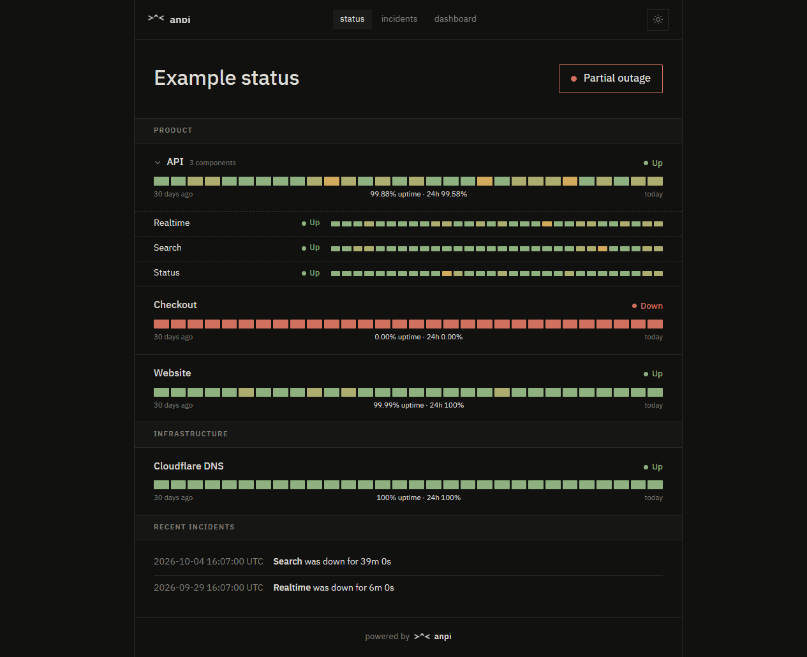
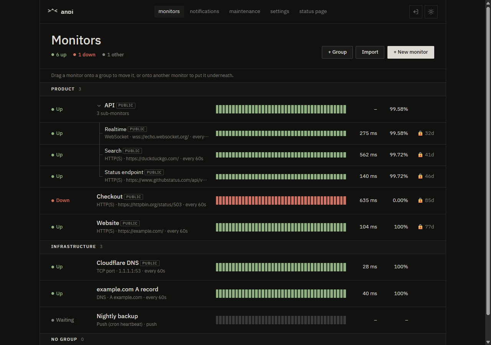
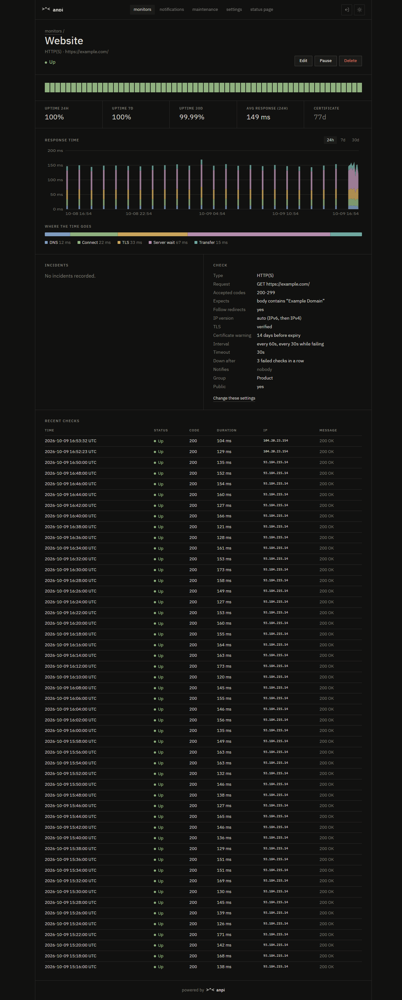
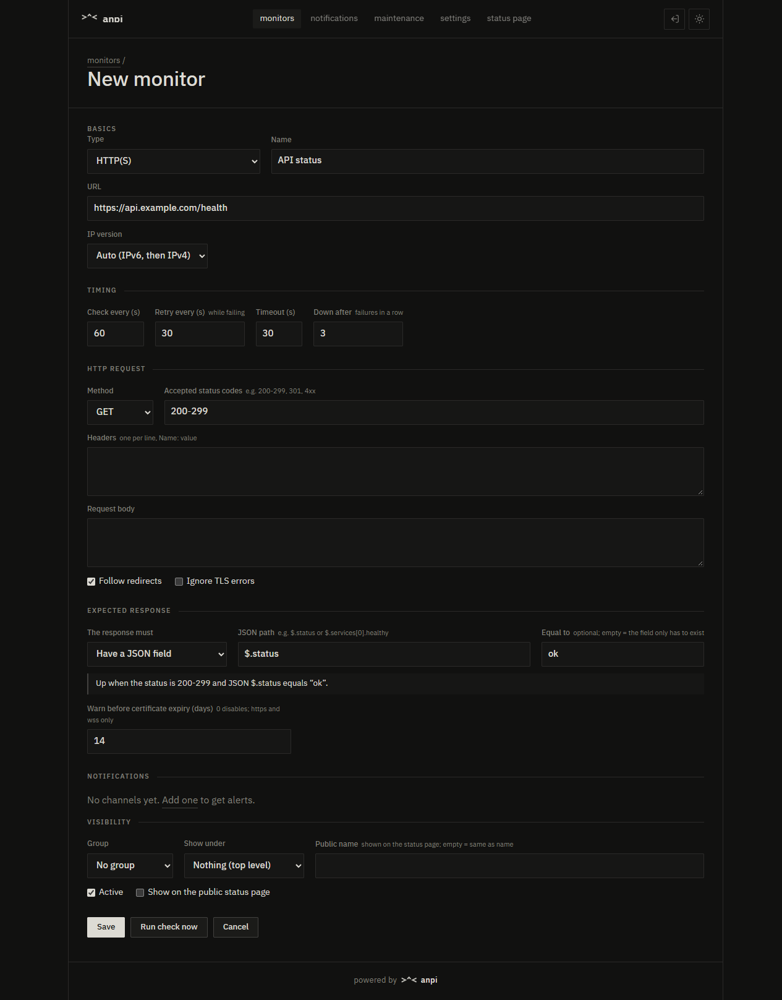

<h1 align="center"><code>&gt;^&lt;</code> anpi</h1>

<p align="center">
  A small, self-hosted uptime monitor written in Rust.<br>
  One ~9&nbsp;MB binary, a few MB of RAM, an embedded SQLite database, a web panel, a public status page and alerts.
</p>

<p align="center">
  <picture>
    <source media="(prefers-color-scheme: light)" srcset="docs/screenshots/status-light.png">
    
  </picture>
</p>

## Why anpi

- **Light.** The release binary is about 9 MB and uses roughly 20 MB of RAM with a handful of monitors (2–5 MB inside Docker). There is no Node, no external database and no CDN; fonts and assets are built in.
- **Tells you *why* something failed.** HTTP checks record DNS, connect, TLS, server-wait and transfer times separately. Auto IP mode shows when IPv6 failed and IPv4 had to take over.
- **Quiet.** A monitor is only marked down after N failures in a row, and each outage sends one alert when it starts and one when it ends.
- **Readable.** Every monitor page spells out exactly what is requested and what counts as up, e.g. *GET https://api.example.com/health — JSON $.status equals "ok" — every 60s, every 30s while failing*.

## Screenshots

| Dashboard | Monitor | New monitor |
|---|---|---|
|  |  |  |

## Quick start

### Docker

```sh
docker compose up -d
docker compose logs anpi | grep "setup code"
```

Open `http://localhost:3000/setup` and enter the setup code from the log to create the first account. The code makes sure only someone with server access can claim a fresh instance. Before you deploy, edit `ANPI_BASE_URL` in `docker-compose.yml`; an `https://` URL turns on secure cookies.

### Binary

```sh
cargo build --release
./target/release/anpi            # listens on 0.0.0.0:3000, data in ./data
```

### Try it with example data

```sh
ANPI_DATA_DIR=/tmp/anpi-demo anpi demo   # groups, sub-monitors and 30 days of history
ANPI_DATA_DIR=/tmp/anpi-demo anpi
```

The public status page is at `/` and the panel at `/admin`.

## Monitors

| Type | What is checked |
|---|---|
| **HTTP(S)** | Method, headers, body; accepted status codes such as `200-299, 301, 4xx`; optional response rule; redirects; certificate expiry |
| **WebSocket** | `ws://` / `wss://` handshake, optional message to send and a rule for the first reply |
| **TCP port** | The port accepts a connection |
| **Ping** | ICMP echo reply |
| **DNS** | A, AAAA, CNAME, MX, NS, TXT, SOA or CAA record, optional resolver and expected value |
| **Push** | Your cron job calls a URL; no call within the interval counts as a failure |
| **Aggregate** | No checks of its own; shows the worst status of the monitors placed under it |

Each monitor has its own interval (default 60 s), retry interval while failing (30 s), timeout, number of failures before it is marked down (3) and IP version (auto, IPv4 only, IPv6 only).

**Response rules.** A response or WebSocket reply can be required to *contain* or *not contain* text, *match a regular expression*, or *have a JSON field*, optionally with a value (`$.status` equals `ok`). The form shows a summary such as *"Up when the status is 200-299 and JSON $.status equals “ok”"*. **Run check now** tries the settings before you save them and shows the status, timings and the start of the response.

**Groups and sub-monitors.** Drag monitors onto a group header to move them, or onto another monitor to put them underneath, e.g. endpoints under an "API" aggregate. Parents show the worst status of their children, and the status page can collapse them.

**Certificates.** HTTPS and WSS monitors warn at the configured window (default 14 days), then at 7, 3 and 1 days before expiry. Each step alerts once, and a renewed certificate starts the sequence again.

## Alerts

Discord, Telegram, ntfy, e-mail (SMTP) and a generic JSON webhook. Add channels under **Notifications**, use **Send test**, then tick them in a monitor's settings. Alerts are sent when a monitor goes down, when it comes back (with the downtime) and when a certificate is about to expire. **Maintenance windows** turn alerts off for chosen monitors; checks keep running and are shown as maintenance.

## Status page and API

`/` lists public monitors by group, with 30-day uptime bars, live updates and recent incidents. Each monitor can have a public name, so internal names stay private. Set the site name and logo under **Settings → Branding**; the logo is also used as the favicon.

`GET /api/status.json` returns the same data for other tools:

```json
{
  "title": "Example status",
  "status": "partial_outage",
  "monitors": [
    { "id": 2, "name": "API", "group": "Product", "status": "up", "uptime_24h": "99.94%", "uptime_30d": "99.88%" },
    { "id": 3, "parent": 2, "name": "Search", "group": "Product", "status": "up", "uptime_24h": "100%", "uptime_30d": "99.94%" }
  ]
}
```

Push monitors show their URL on the monitor page:

```sh
curl -fsS "https://status.example.com/api/push/<token>?status=up&msg=OK&ping=1234"
```

## Sign-in and SSO

The first account is created with the setup code from the log. More password accounts can be added under **Settings → Users**.

Single sign-on works with Keycloak or any OpenID Connect provider. You can set it under **Settings → Single sign-on** (public URL, issuer, client ID and secret, an optional required role or group) or with environment variables, which take precedence. With SSO on, password sign-in is turned off. The panel will not turn SSO on unless the provider answers, and `anpi disable-sso` on the server turns it off again if you get locked out.

For Keycloak:

1. Create an OpenID Connect client with **Client authentication** and **Standard flow** enabled.
2. Set **Valid redirect URIs** to `https://status.example.com/auth/oidc/callback` and **Valid post logout redirect URIs** to `https://status.example.com/`.
3. Optional: require a realm role, client role or group, for example `monitoring`.

PKCE is always used. The ID token's issuer, audience, expiry and nonce are checked, and the login state is bound to the browser that started it.

## Configuration

| Variable | Default | |
|---|---|---|
| `ANPI_BIND` | `0.0.0.0:3000` | Listen address |
| `ANPI_DATA_DIR` | `./data` | Directory for `anpi.db` (`ANPI_DATABASE` sets the file path directly) |
| `ANPI_BASE_URL` | – | Public URL, e.g. `https://status.example.com`. Used for links and SSO; `https` turns on secure cookies |
| `ANPI_TRUST_PROXY` | `false` | Use `X-Forwarded-For` for login rate limiting behind a reverse proxy |
| `ANPI_MAX_CONCURRENT_CHECKS` | `64` | Upper bound on checks running at once |
| `ANPI_LOG` | `info` | Log filter, e.g. `debug` or `anpi=debug` |
| `ANPI_OIDC_ISSUER`, `ANPI_OIDC_CLIENT_ID`, `ANPI_OIDC_CLIENT_SECRET` | – | SSO from the environment; overrides the panel |
| `ANPI_OIDC_REQUIRED_ROLE`, `ANPI_OIDC_SCOPES` | –, `openid profile email` | |

Everything else is set in the panel.

## Data and retention

Checks are stored for 24 hours, then rolled up into hourly averages kept for a year; closed incidents are kept for a year. All three periods can be changed under **Settings**. Uptime figures and charts read across raw and hourly data, so pruning never changes them. A few dozen monitors stay well under 100 MB, and the current database size is shown in the settings.

## Deployment notes

- **systemd:** `deploy/anpi.service` runs anpi as an unprivileged user with a hardened sandbox; `deploy/anpi.env.example` lists the settings.
- **Reverse proxy:** put Caddy or nginx in front for HTTPS and set `ANPI_TRUST_PROXY=true`.
- **IPv6 in Docker:** IPv6 monitors need IPv6 inside the container. Enable it in the Docker daemon or use `network_mode: host`.
- **Ping:** ICMP needs `CAP_NET_RAW` (granted in the systemd unit) or unprivileged ICMP sockets through `net.ipv4.ping_group_range`, which Docker allows by default.

## Command line

```sh
anpi                          # run the server
anpi demo                     # fill an empty database with example data
anpi healthcheck              # exit 0 if the local server is healthy (used by Docker)
anpi reset-password <user>    # set a new password from stdin and sign out old sessions
anpi disable-sso              # turn off SSO configured in the panel
```

## Development

```sh
cargo test                    # unit and integration tests; everything runs locally
cargo clippy --all-targets
```

The integration tests start real local servers (HTTP, self-signed HTTPS, a WebSocket echo server, a webhook receiver and a mock OIDC provider). They check that each outage produces exactly one down and one recovery alert, that maintenance and restarts stay quiet, IPv4/IPv6 selection, TLS and certificate handling, retention, CSRF and origin checks, login rate limiting, drag and drop moves and the full SSO flow.

`design/playground.html` is a standalone page for trying layout, font and colour changes against the real stylesheet; open it straight from disk.

```
src/checks      HTTP client with phase timings, WebSocket, TCP, ping, DNS, response rules
src/monitor     scheduler, state machine, certificate warnings, batched writer
src/notify.rs   alert channels
src/stats.rs    reads across raw and hourly data; src/retention.rs rolls up and prunes
src/auth        passwords, rate limiting, OIDC, SSO settings
src/web         axum handlers and SVG charts; HTML in templates/, CSS and JS in static/
```
