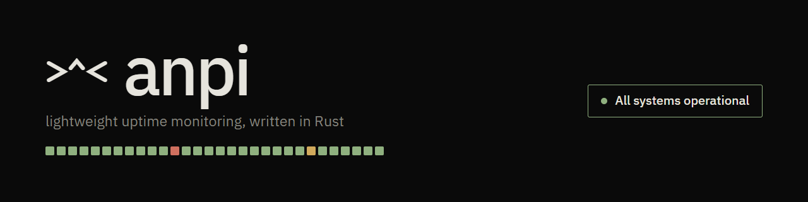
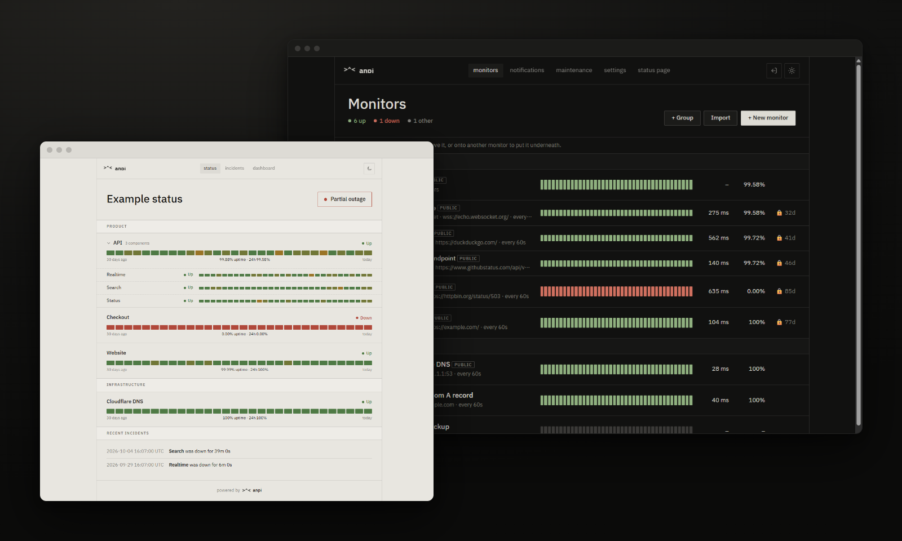

<p align="center">
  
</p>

A small, self-hosted uptime monitor written in Rust: one ~9&nbsp;MB binary that needs a few MB of RAM, an embedded SQLite database, a web panel, a public status page and alerts to Discord, Telegram, ntfy, e-mail or webhooks. It checks HTTP(S), WebSocket, TCP, ping, DNS and cron push monitors, and records DNS, connect, TLS and response times separately.

<p align="center">
  
</p>

## Install

### Docker

Images for `linux/amd64` and `linux/arm64` are published with every release:

```sh
docker run -d --name anpi -p 3000:3000 -v anpi-data:/data ghcr.io/igorovh/anpi:latest
docker logs anpi 2>&1 | grep "setup code"
```

or `docker compose up -d` with the included [`docker-compose.yml`](docker-compose.yml). Open `http://localhost:3000/setup` and enter the setup code from the log to create the first account; the code makes sure only someone with server access can claim a fresh instance. When anpi runs behind HTTPS, set `ANPI_BASE_URL` (e.g. `https://status.example.com`) to turn on secure cookies.

### Binary

Download an archive for your platform from [Releases](https://github.com/igorovh/anpi/releases): Linux x86_64 and ARM64 (static, any distribution), Windows x86_64 and macOS (Apple silicon). Each archive includes the systemd unit from `deploy/`.

```sh
tar xzf anpi-v0.2.2-x86_64-unknown-linux-musl.tar.gz
./anpi-v0.2.2-x86_64-unknown-linux-musl/anpi      # listens on 0.0.0.0:3000, data in ./data
```

Later, `sudo anpi update` installs the newest release and restarts the service ([details](docs/configuration.md#updating)).

### From source

```sh
cargo build --release          # or: docker build -t anpi .
```

The public status page is at `/` and the panel at `/admin`.

## Documentation

- [Monitoring](docs/monitoring.md): monitor types, response rules, groups and sub-monitors, alerts, the status page and its JSON API
- [Configuration and deployment](docs/configuration.md): environment variables, SSO with Keycloak, data retention, systemd and Docker notes, command line
- [Development](docs/development.md): example data, tests, project layout and releases

## License

[MIT](LICENSE). The bundled IBM Plex Sans JP font is under the [SIL Open Font License 1.1](static/fonts/OFL.txt).
